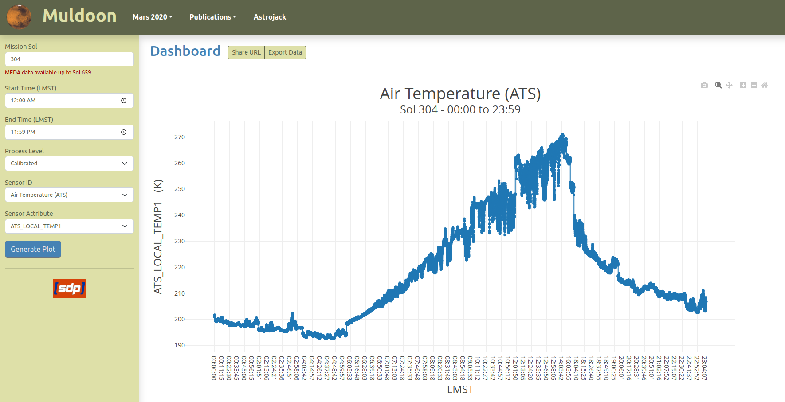
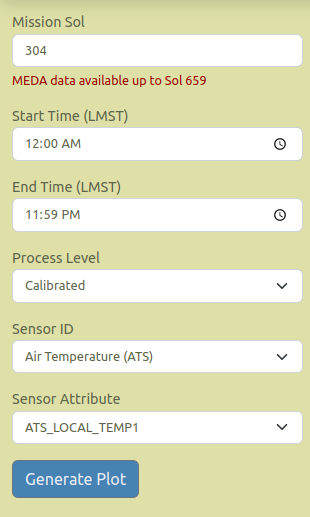
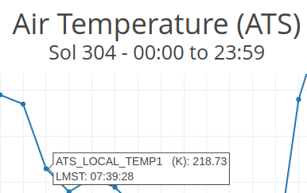

<h2>Team Members</h2>
 <ul>
   <li>Spencer Mirly</li>
   <li>Matthew Rockenhaus</li>
   <li>Ryan Rickerl</li>
</ul>

<h2>Abstract</h2>

Large dust storms are a common occurrence on Mars. Martian dust devils are known to contribute to
these dust storms and are thought to be an even larger contributor to these storms. The Python
package Muldoon was created to analyze data from the Mars Environmental Dynamics Analyzer
(MEDA) to find these dust devils from wind speed and air pressure data. The extent to which these
dust devils affect Martian atmospheric conditions is currently not well known. Allowing researchers
to analyze this data to search for dust devils helps fill these holes in the data.

While the Muldoon program is currently capable of generating graphs to visualize the Martian data,
the images are static and can only be viewed locally. The aim of this project is to create an
interactive webpage that can render the Mars 2020 MEDA data graphs dynamically, allowing researchers
to explore the data and collarborate in a more effective manner. Incorporation of Muldoon’s
existing analysis tools will build upon the interactive webpage implementation in the future.

<h2>Project Description</h2>
 <ul>
   <li>What was built</li>
   <li>How it works</li>
   <li>Screenshots</li>
</ul>

<figure>
  
  <figcaption>Figure 1: Muldoon application</figcaption>
</figure>

<h3>User Interface (UI)</h3>
<figure>
  
  <figcaption>Figure 2: User interface (UI) for Mulldoon application</figcaption>
</figure>

Lorem Ipsum is simply dummy text of the printing and typesetting industry. Lorem Ipsum has been the
industry's standard dummy text ever since the 1500s, when an unknown printer took a galley of type and
scrambled it to make a type specimen book. It has survived not only five centuries, but also the leap into
electronic typesetting, remaining essentially unchanged. It was popularised in the 1960s with the release
of Letraset sheets containing Lorem Ipsum passages, and more recently with desktop publishing software
like Aldus PageMaker including versions of Lorem Ipsum.

<ul>
  <li><b>Sol</b>
    
Integer element for selection of Mars rover Perseverance mission sol.

  </li>
  <li><b>Start Time</b>
    
Time entry element for starting range of MEDA data selection in 24 hour format; HH:mm:ss.

  </li>
  <li><b>End Time</b>
    
Time entry element for ending range of MEDA data in 24 hour format; HH:mm:ss.

  </li>
  <li><b>Process Level</b>
    
Selection element populated with available MEDA process levels; calibrated or derived are
    currently supported.

  </li>
  <li><b>Sensor ID</b>
    
Selection element populated with available MEDA sensor ID(s) for the selected
    process level.

  </li>
  <li><b>Sensor Attribute</b>
    
Selection element populated with y-axis attribute(s) for the selected sensor ID.

  </li>
</ul>
 

<h3>Plot Dashboard Options</h3>

Lorem Ipsum is simply dummy text of the printing and typesetting industry. Lorem Ipsum has been the
industry's standard dummy text ever since the 1500s, when an unknown printer took a galley of type and
scrambled it to make a type specimen book.

<figure>
  
  <figcaption>Figure 3: Dashboard options for Muldoon application</figcaption>
</figure>

<ul>
  <li><b>Share URL</b>
    
(needs description)

  </li>
  <li><b>Export Data</b>
    
(needs description)

  </li>
</ul>

<h3>Plot Navigation Options</h3>

Lorem Ipsum is simply dummy text of the printing and typesetting industry. Lorem Ipsum has been the
industry's standard dummy text ever since the 1500s, when an unknown printer took a galley of type and 
scrambled it to make a type specimen book.

<figure>
  
  <figcaption>Figure 4: Plot navigation options for Muldoon application</figcaption>
</figure>

<ul>
  <li><b>Download plot as png</b>
    
(needs description)

  </li>
  <li><b>Zoom</b>
    
(needs description)

  </li>
  <li><b>Pan</b>
    
(needs description)

  </li>
  <li><b>Zoom in</b>
    
(needs description)

  </li>
  <li><b>Zoom out</b>
    
(needs description)

  </li>
  <li><b>Reset axes</b>
    
(needs description)

  </li>
</ul>

<h3>Plot Hover Tooltips</h3>

Lorem Ipsum is simply dummy text of the printing and typesetting industry. Lorem Ipsum has been the
industry's standard dummy text ever since the 1500s, when an unknown printer took a galley of type and
scrambled it to make a type specimen book. It has survived not only five centuries, but also the leap into
electronic typesetting, remaining essentially unchanged. It was popularised in the 1960s with the release
of Letraset sheets containing Lorem Ipsum passages, and more recently with desktop publishing software
like Aldus PageMaker including versions of Lorem Ipsum.

<figure>
  
  <figcaption>Figure 5: Plot hover tooltip for Muldoon application</figcaption>
</figure>