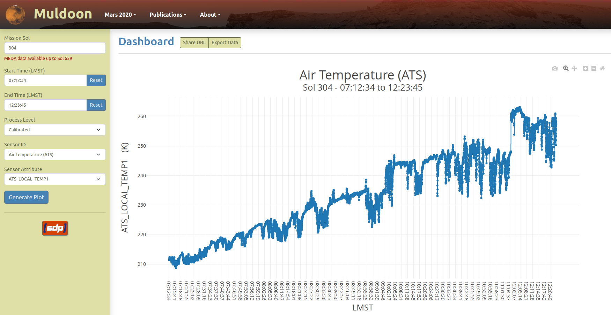
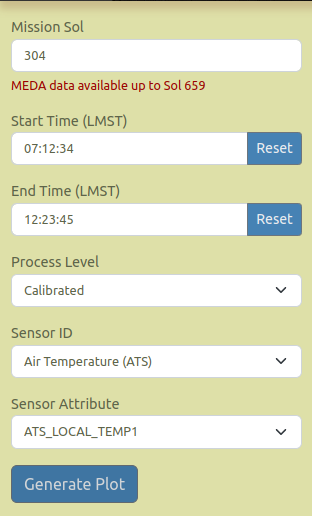

<h2>Team Members</h2>
 <ul>
   <li>Spencer Mirly</li>
   <li>Matthew Rockenhaus</li>
   <li>Ryan Rickerl</li>
</ul>

<h2>Abstract</h2>

Large dust storms are a common occurrence on Mars. Martian dust devils are known to contribute to
these dust storms and are thought to be an even larger contributor to these storms. The Python
package Muldoon was created to analyze data from the Mars Environmental Dynamics Analyzer
(MEDA) to find these dust devils from wind speed and air pressure data. The extent to which these
dust devils affect Martian atmospheric conditions is currently not well known. Allowing researchers
to analyze this data to search for dust devils helps fill these holes in the data.

While the Muldoon program is currently capable of generating graphs to visualize the Martian data,
the images are static and can only be viewed locally. The aim of this project is to create an
interactive webpage that can render the Mars 2020 MEDA data graphs dynamically, allowing researchers
to explore the data and collarborate in a more effective manner. Incorporation of Muldoon’s
existing analysis tools will build upon the interactive webpage implementation in the future.

<h2>Project Description</h2>

<h3>What was built</h3>

 The final product that was built is a website that allows the user to select a specific Sol(A day on Mars) as well as the time range and type of data to display.  Once this information is selected the user will then be able to generate an interactive graph.  Once the graph has been generated that user will then be able to zoom in on the graph to get a better understanding of what is happening.  They will also have the option to save the image or copy the link to send to someone else so they can generate the exact same graph.  

By just using Javascript and Node.js instead of a large frontend framework we were able to build a lighter website that is easier to manage.  To generate the graph used the Plotly for Javascript library. 

<figure>
  
  <figcaption>Figure 1: Muldoon application</figcaption>
</figure>

<h3>User Interface (UI)</h3>

The user interface is several fields that allow you to narrow down was data is displayed.

<figure>
  
  <figcaption>Figure 2: User interface (UI) for Muldoon application</figcaption>
</figure>

<ul>
  <li><b>Sol</b>
    
Integer element for selection of Mars rover Perseverance mission sol.

  </li>
  <li><b>Start Time</b>
    
Time entry element for starting range of MEDA data selection in 24 hour format; HH:mm:ss.

  </li>
  <li><b>End Time</b>
    
Time entry element for ending range of MEDA data in 24 hour format; HH:mm:ss.

  </li>
  <li><b>Process Level</b>
    
Selection element populated with available MEDA process levels; calibrated or derived are
    currently supported.

  </li>
  <li><b>Sensor ID</b>
    
Selection element populated with available MEDA sensor ID(s) for the selected
    process level.

  </li>
  <li><b>Sensor Attribute</b>
    
Selection element populated with y-axis attribute(s) for the selected sensor ID.

  </li>
</ul>
 

<h3>Plot Dashboard Options</h3>

The ability to collaborate with peers has been implemented through the <i>Share URL</i> and <i>Export Data</i> functions seen in Figure 3.

<figure>
  
  <figcaption>Figure 3: Dashboard options for Muldoon application</figcaption>
</figure>

<ul>
  <li><b>Share URL</b>
    
Button which copies the current plot conditions (including zoom constraints) to the clipboard. An
    option to manually copy the link is also presented with timeout delay of 15s.

    
<i>Note: for copy-to-clipboard to function properly, the browser requires clipboard write
    permission.</i>

  </li>
  <li><b>Export Data</b>
    
Button for downloading the current plot MEDA data file.

  </li>
</ul>

<h3>Plot Navigation Options</h3>

The Plotly javascript library provides a set of built functions (Figure 4) for navigation; displayed
in the upper right corner of the visualization. Each function is described from left to right below.

<figure>
  
  <figcaption>Figure 4: Plot navigation options for Muldoon application</figcaption>
</figure>

<ul>
  <li><b>Download plot as png</b>
    
Download a png image of the current plot view.

  </li>
  <li><b>Zoom</b>
    
Zoom an area of the current plot by dragging a selection with the mouse.

  </li>
  <li><b>Pan</b>
    
Pan the current plot by dragging the mouse.

  </li>
  <li><b>Zoom in</b>
    
Zoom in the center point of the current plot.

  </li>
  <li><b>Zoom out</b>
    
Zoom out the center point of the current plot.

  </li>
  <li><b>Reset axes</b>
    
Reset the current plot axes and display the entire range of data requested by <i>Start Time</i> and
    <i>End Time</i> inputs.

  </li>
</ul>

<h3>Plot Hover Tooltips</h3>

Hover tooltips are displayed on mouseover of any data point of the current plot.

<figure>
  
  <figcaption>Figure 5: Plot hover tooltip for Muldoon application</figcaption>
</figure>
